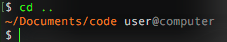
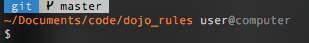
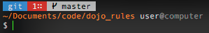
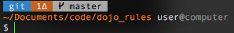
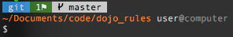
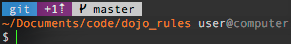
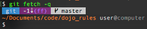
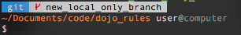
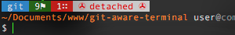

# Git Aware Terminal
At Zetta we love Git.  It's like adding a third dimension to your world when you've been living in two.  However, as powerful as it is, it requires a great deal of effort to learn and be effective at, and even if you are already a git master it still takes extra seconds here and there to maintain your awareness of what status your project is in.

**Enter the Git Aware Terminal.**

It is a little scripting combined with a little design to yeild a much more usable git experience.

Git aware prompt views | &nbsp;
------- | --------
Our **non-git directory** prompt looks like this. Git is not initialized for this directory:<br> | When we go into our **git project** directory:<br>
An **untracked** file:<br> | A **modified**, unadded file:<br>
A file **pending commit**:<br> | Post commit we are now **one commit ahead** of remote origin:<br>
A coworker just pushed a change, now after a fetch we se we're **behind by one**:<br> | Just created a **new local branch** that doesn't exist on remote:
A currently **detached** repo:<br> | 

## Installation

1. Edit your bash config.  In OSX it is located here: `~/.bash_profile`.
   Add the following to the top of your file and save it:
    ```bash
    if [ -f ~/.git-aware-terminal.bash ]; then
    . ~/.git-aware-terminal.bash
    fi
    PROMPT_COMMAND="parse_git_branch"
    ...
    ```
2. Ensure that you aren't already using `PROMPT_COMMAND=` and if you are, just add `parse_git_branch; ...` to it.
3. Download and save `.git-aware-terminal.bash` to your `~/` directory.
4. Run `. ~/.bash_profile` to reload your terminal and enable the newly added code, or close your terminal and restart it.
